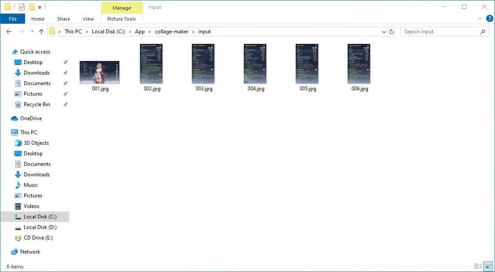
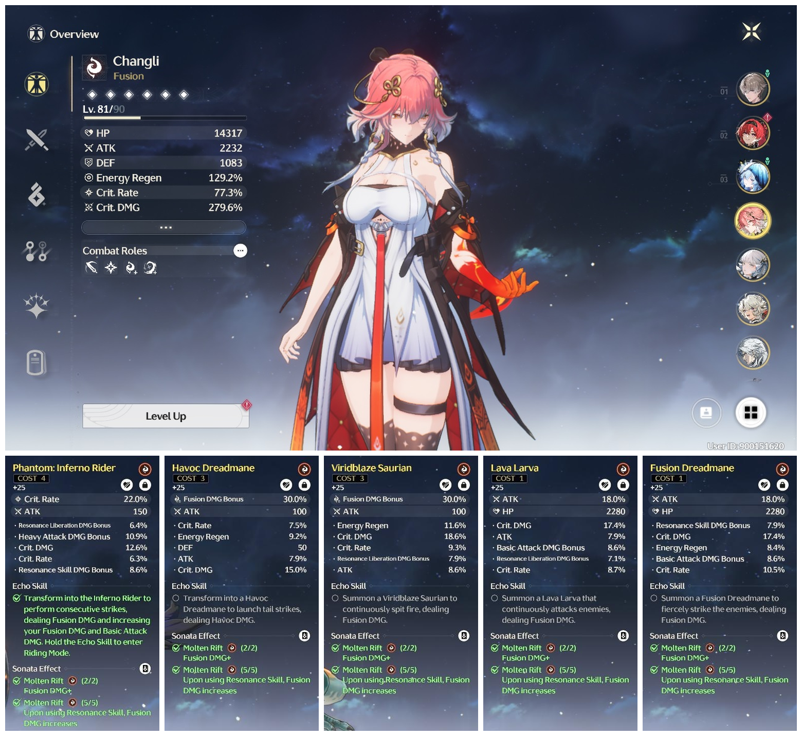
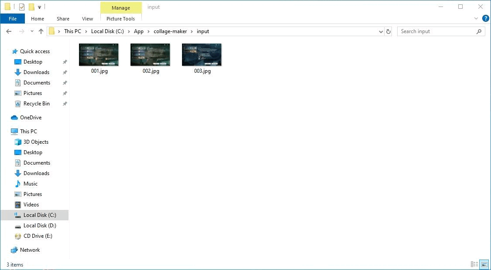
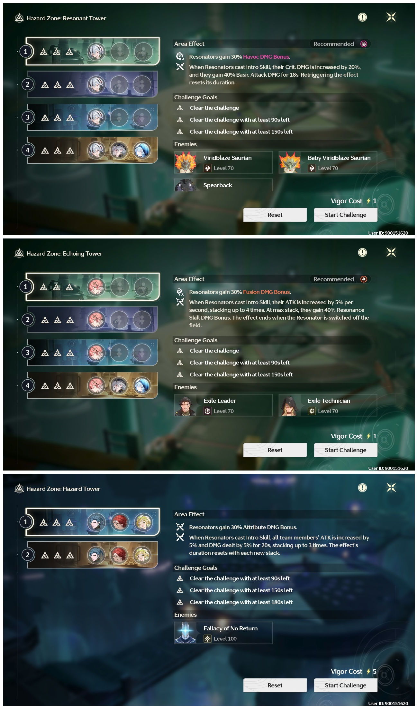

# collage-maker
This repository contains a Python script that allows you to create custom image collages by arranging images from a specified directory. The script supports various layout options, including a grid-based layout or a user-defined layout based on a JSON configuration file. Additionally, it includes features for adjusting margin spacing between images and rounding the corners of the images in the collage.

# Related repository
- [batch-crop](https://github.com/mrizkihidayat66/batch-crop.git)

# Requirements
- Python

# Setup
1. git clone https://github.com/mrizkihidayat66/collage-maker.git
2. pip install -r requirements.txt

# Usage
> python main.py

